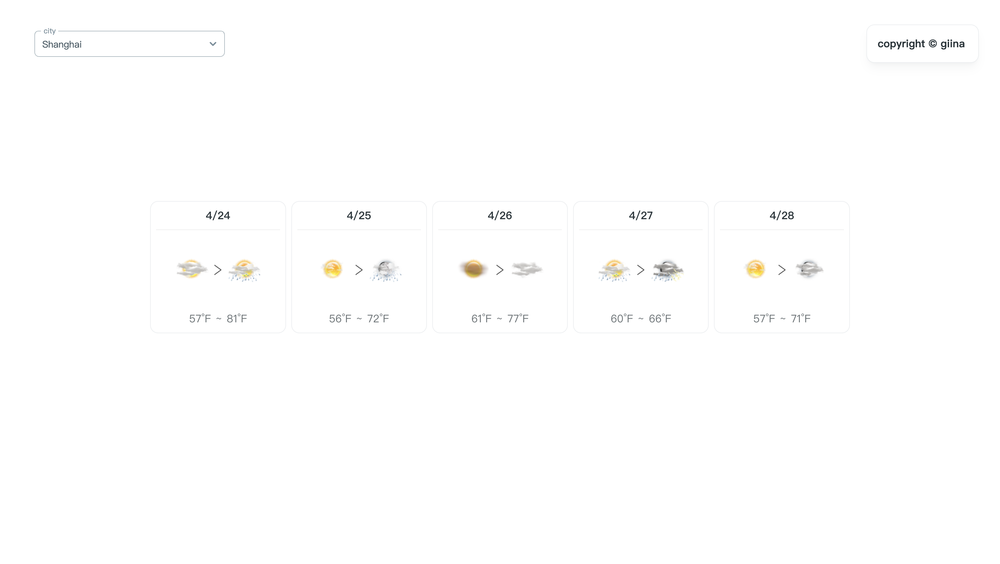

## Target

**接口只提供5天免费的预报**



### 需求

- [x] 实现一个单页应用,显示上海未来七天内的温度和天气。 需要有一定的样式。
  - [x] 1.react + typescript实现。
  - [x] 2.接口自己查找, 需要实时数据。
      * Accu weather api
    
  - [x] 3.附加需求:页面上提供输入可以切换城市。
  
- [ ] 根据浏览器定位获取位置到默认城市

### 技术要点

- [x] UI
  - [x] pc
  - [x] mobile
- [ ] API
  - [x] loading
  - [ ] failed
- [ ] 自动化测试
  - [ ] jest->mock data->snapshot
- [ ] 优化
  - [ ] size
    - [ ] 压缩图片
  - [ ] 并发请求数量
    - [ ] 雪碧图
  - [ ] 视障

## Getting Started

First, run the development server:

```bash
npm run dev
# or
yarn dev
# or
pnpm dev
```

Open [http://localhost:3000](http://localhost:3000) with your browser to see the result.

You can start editing the page by modifying `pages/index.tsx`. The page auto-updates as you edit the file.

[API routes](https://nextjs.org/docs/api-routes/introduction) can be accessed on [http://localhost:3000/api/hello](http://localhost:3000/api/hello). This endpoint can be edited in `pages/api/hello.ts`.

The `pages/api` directory is mapped to `/api/*`. Files in this directory are treated as [API routes](https://nextjs.org/docs/api-routes/introduction) instead of React pages.

This project uses [`next/font`](https://nextjs.org/docs/basic-features/font-optimization) to automatically optimize and load Inter, a custom Google Font.

## Next.js + React.js + material-tailwind

To learn more about Next.js, take a look at the following resources:

- [Next.js Documentation](https://nextjs.org/docs) - learn about Next.js features and API.
- [Learn Next.js](https://nextjs.org/learn) - an interactive Next.js tutorial.

You can check out [the Next.js GitHub repository](https://github.com/vercel/next.js/) - your feedback and contributions are welcome!

